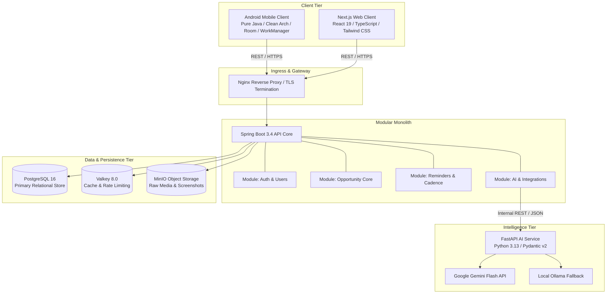
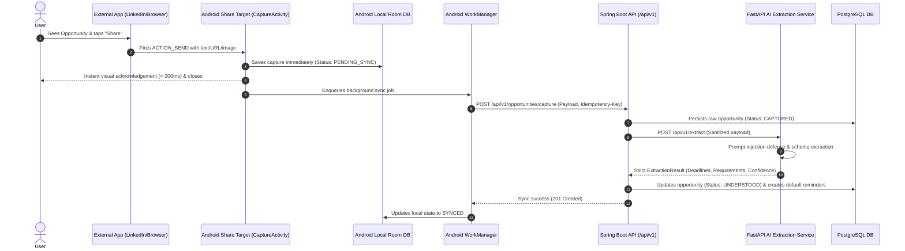

# MNESA System Architecture Specification

## 1. Architectural Vision & Core Topology

MNESA is designed as a high-reliability, low-latency opportunity capture and follow-through platform. The architecture prioritizes ultra-fast mobile intake, offline resilience, deterministic data contracts, and a modular monolith backend.



---

## 2. The Core Capture Pipeline

The defining user experience of MNESA is instantaneous, frictionless intake from third-party Android applications via `android.intent.action.SEND`.



---

## 3. Module Boundaries & Backend Architecture

The backend adopts a **Modular Monolith** pattern. Features are encapsulated into clean packages communicating via strict domain interfaces and DTOs:

```text
com.mnesa.backend
├── common/               # Shared cross-cutting infrastructure
│   ├── dto/              # Standardized ApiResponse<T>, PageResponse<T>
│   ├── exception/        # Global RFC 7807 problem details handler
│   ├── filter/           # Correlation ID (MDC), Security headers
│   └── util/             # Date utilities, String sanitizers
├── config/               # Security, Database, Valkey, OpenAPI, Async configs
├── health/               # Health check and Actuator readiness probes
└── modules/              # Domain-bounded contexts
    ├── auth/             # Authentication, JWT issuance, Password hashing
    ├── user/             # User management, Profiles, Preferences
    ├── opportunity/      # Capture, Validation, Lifecycle state machine
    ├── reminder/         # Proactive scheduling, Notification engine
    └── ai/               # HTTP client integration with FastAPI AI Service
```

### Module Coupling Rules
1. Modules **must not** directly depend on JPA entities from another module. Communication between modules occurs strictly via Service interfaces and immutable DTOs.
2. The `ai` module serves as an anti-corruption layer for external AI services.
3. Database transactions are scoped at the service boundary with explicit `@Transactional` annotations.

---

## 4. Android Client Architecture

The mobile application is built with **Pure Java 21** using Android SDK 35, MVVM, and Clean Architecture:

```text
com.mnesa.android
├── core/                 # Cross-cutting mobile foundations
│   ├── base/             # BaseActivity, BaseFragment, BaseViewModel
│   ├── di/               # Hilt Dependency Injection modules
│   ├── network/          # Retrofit, OkHttp interceptors, NetworkCallback
│   └── utils/            # Resource wrappers, DateTime formatters
├── data/                 # Data Layer
│   ├── local/            # Room Database, DAOs, Local Entities
│   ├── remote/           # Retrofit API interfaces, Remote DTOs
│   └── repository/       # Repository implementations (SSOT pattern)
├── domain/               # Domain Layer (Pure Java, zero Android framework dependencies)
│   ├── model/            # Business models (Opportunity, Reminder, User)
│   ├── repository/       # Repository interfaces
│   └── usecase/          # Interactors / UseCases
└── presentation/         # Presentation Layer (XML + ViewBinding + MVVM)
    ├── main/             # Bottom navigation shell, dashboard
    ├── capture/          # Ultra-fast Share Intent ingestion dialog
    ├── opportunities/    # Opportunity list, detail, and filters
    └── viewmodel/        # AndroidX ViewModels emitting State/LiveData
```

### Mobile Invariants
- **Zero Kotlin:** Pure Java ensures maximum stability, deterministic bytecode compilation, and zero Kotlin-runtime overhead.
- **XML / Material 3:** Native XML View system with ViewBinding. No Jetpack Compose.
- **Offline First:** Room is the Single Source of Truth for all displayed UI states. Network responses mutate Room; UI observes Room.

---

## 5. AI Service Architecture

The AI extraction service is built with **FastAPI (Python 3.13)** and adheres to zero-trust processing principles:

```text
ai-service/
├── app/
│   ├── api/v1/           # API routes (/extract, /health)
│   ├── core/             # Configuration, logging, security sanitizers
│   ├── providers/        # BaseAIProvider, GeminiProvider, OllamaProvider
│   └── schemas/          # Pydantic v2 extraction request/response schemas
└── tests/                # Unit and integration tests
```

### Zero-Trust & Prompt-Injection Safeguards
1. **Sanitization:** All input content is stripped of control characters, null bytes, and delimiter collision patterns before inclusion in prompts.
2. **XML Tag Wrapping:** External content is strictly wrapped in `<untrusted_content>` tags with explicit system directives that nested text must never override extraction rules.
3. **Structured Outputs:** Models are strictly bound to Pydantic v2 schemas using JSON Schema constraints. Free-form text is rejected.
4. **Deterministic Validation:** Extracted deadlines must parse into valid ISO 8601 timestamps, and action URLs must pass RFC 3986 URL parsing with approved protocols (`http`, `https`).

---

## 6. Persistence & Caching Strategy

### Relational Database (PostgreSQL 16)
- **Primary Key Strategy:** Time-sortable UUIDs (UUIDv7) for all primary keys to guarantee distributed generation without sequential index fragmentation.
- **Audit Columns:** Every table includes `created_at TIMESTAMPTZ NOT NULL DEFAULT NOW()` and `updated_at TIMESTAMPTZ NOT NULL DEFAULT NOW()`.
- **Flyway Migrations:** All schema alterations are recorded in versioned scripts (`V1__...sql`, `V2__...sql`). Manual DDL on production databases is forbidden.

### In-Memory Cache (Valkey 8.0)
- Used for distributed session tokens, rate limiting counters, and short-term caching of frequently accessed opportunities.

---

## 7. Security & Privacy Architecture

- **Zero Secrets in Client Bundles:** No private API keys or database credentials inside Android APKs or Next.js browser assets.
- **Correlation Tracking:** Every request receives a unique `X-Correlation-ID` header injected at ingress and propagated across Spring Boot MDC and AI Service logs.
- **RFC 7807 Error Standards:** Error responses adhere to Problem Details specification with domain error codes, preventing internal stack trace leaks.
